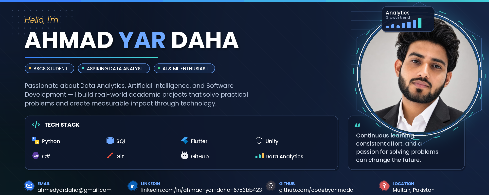

  

<h1 align="center">Hi 👋, I'm Ahmad Yar Daha</h1>

<h3 align="center">
BSCS Student • Aspiring Data Analyst • AI & Machine Learning Enthusiast
</h3>

---
# 👋 Hi, I'm Ahmad Yar Daha

### Computer Science Student | Data Analytics | AI & Machine Learning | Software Development

I'm a Computer Science student with a strong interest in **Data Analytics, Artificial Intelligence, Machine Learning, and Software Development**. I enjoy building practical projects, exploring new technologies, and continuously developing my technical skills through hands-on learning.

---

## 🚀 About Me

* 🎓 **BS Computer Science Student**
* 📊 Interested in **Data Analytics & Data Visualization**
* 🤖 Exploring **Artificial Intelligence & Machine Learning**
* 💻 Building practical applications with **Python and modern development tools**
* 📱 Gaining hands-on experience in **Mobile Application Development**
* 🌱 Continuously learning through projects, internships, certifications, and technical training

---

## 🛠️ Technical Skills

### Programming & Development

* Python
* Dart
* JavaScript
* SQL

### Data & Analytics

* Pandas
* NumPy
* Matplotlib
* Plotly
* Data Cleaning
* Exploratory Data Analysis
* Data Visualization
* Statistical Analysis

### AI & Machine Learning

* Machine Learning
* Deep Learning Fundamentals
* Generative AI
* AI-assisted Data Analysis
* Predictive Analysis
* Natural Language Interaction with Data

### Frameworks & Tools

* Streamlit
* Flutter
* Git & GitHub
* VS Code
* Jupyter Notebook

---

# 💼 Internship & Professional Experience

## 🤖 Machine Learning Intern — CodeAlpha

**August 1, 2026 – August 30, 2026**

Selected for a **Machine Learning Internship at CodeAlpha**, focused on strengthening practical Machine Learning skills through hands-on tasks, technical learning, and project-based development.

**Focus Areas:**

* Machine Learning
* Practical model development
* Data analysis and preprocessing
* Project-based learning

---

## 📱 Intern – Mobile Application Development — WeWorkLocal

**July 8, 2026 – October 2026 | 3 Months**

Selected as an **Intern – Mobile Application Development at WeWorkLocal**, with an opportunity to contribute to real-time projects and gain practical experience in mobile application development.

**Focus Areas:**

* Mobile Application Development
* Real-world application development
* Development workflows
* User-focused solutions
* Team-based project experience

---

# 📜 Certifications & Professional Learning

## 1. Deloitte — Data Analytics Job Simulation

**Issued:** July 29, 2026
**Issuer:** Deloitte / Forage

Completed the **Deloitte Data Analytics Job Simulation**, gaining practical exposure to data analysis and forensic technology tasks in a simulated professional environment.

🔗 [View Project Repository](https://github.com/codebyahmadd/Deloitte-Data-Analytics-Job-Simulation)

---

## 2. AWS — Professional Certification

Completed AWS training and certification focused on developing foundational knowledge of cloud technologies and related concepts.

---

## 3. AWS — Professional Certification

Completed an additional AWS certification, strengthening practical understanding of cloud computing concepts and modern technology services.

---

## 4. Saylor University — CS250: Python for Data Science

**Issued:** August 4, 2026
**Course:** CS250: Python for Data Science
**Course Duration:** 67 Hours
**Grade:** 80.17%

Completed **CS250: Python for Data Science**, developing practical knowledge of Python programming and its application to data science workflows.

---

## 5. IBM SkillsBuild — Machine Learning for Data Science Projects

**Issued:** July 26, 2026
**Issuer:** IBM SkillsBuild

Completed **Machine Learning for Data Science Projects**, strengthening practical understanding of Machine Learning concepts and their application to data science projects.

---

## 6. IBM SkillsBuild — Generative AI Essentials: Using LLMs to Work with Data

**Issued:** July 26, 2026
**Issuer:** IBM SkillsBuild

Completed **Generative AI Essentials: Using LLMs to Work with Data**, developing an understanding of how Large Language Models can support data-related workflows and analysis.

---

## 7. WeWorkLocal / LocalWala Academy — Mobile E-Commerce Mastery

**Issued:** July 28, 2026
**Score:** 100%
**Issuer:** WeWorkLocal / LocalWala Academy

Successfully completed **LocalWala Academy: Mobile E-Commerce Mastery** with a score of **100%**, strengthening practical understanding of mobile e-commerce concepts.

---

## 8. NFC Innovation Expo — Certificate of Participation

Received a certificate in recognition of **active participation and innovative project presentation at the NFC Innovation Expo**.

**Institution:** NFC Institute of Engineering & Technology, Multan

---

## 9. NAVTTC — Artificial Intelligence

Completed a professional training program in:

* Artificial Intelligence
* Machine Learning
* Deep Learning
* Communication

**Program:** Prime Minister's Youth Skills Development Program
**Institution:** NFC Institute of Engineering & Technology, Multan
**Grade:** A+

---

## 📊 Featured Projects

### 🤖 AI Data Analyst — InsightGPT

An interactive AI-powered data analysis platform designed to simplify the process of exploring, analyzing, visualizing, and understanding datasets through a single interface.

**Key Features:**

* CSV dataset upload
* Automated data cleaning
* Dataset exploration and statistical analysis
* Interactive visualizations
* AI-powered insights and recommendations
* Sales trend analysis
* Sales forecasting
* Chat with Data
* Business performance analysis
* Automated report generation
* Dataset summaries

**Technologies:** Python, Pandas, Plotly, Streamlit

🔗 **GitHub:** https://github.com/codebyahmadd/AI-Data-Analyst

---

### 📊 Sales Data Analytics Dashboard

An interactive dashboard built to transform raw sales data into meaningful business insights through data cleaning, analysis, visualization, and interactive exploration.

**Technologies:** Python, Pandas, Streamlit, Matplotlib

🔗 **Live Demo:** https://sales-data-analytics-project-qy25mzzhvv3i7wex6lzqqn.streamlit.app/

🔗 **GitHub:** https://github.com/codebyahmadd/sales-data-analytics-project

---

### 📈 Deloitte Data Analytics Job Simulation

A practical data analytics project completed as part of the Deloitte Data Analytics Job Simulation, focused on applying analytical thinking and data-driven problem solving in a simulated professional environment.

**Technologies:** Data Analysis, Data Visualization, Excel, Data Interpretation

🔗 **GitHub:** https://github.com/codebyahmadd/Deloitte-Data-Analytics-Job-Simulation

---

# 🎓 Relevant Coursework

* Data Structures & Algorithms
* Database Systems
* Artificial Intelligence
* Machine Learning
* Software Engineering
* Computer Networks

---

# 🏆 Activities & Involvement

**Active Member — EMC Community, SciTech Society**
Department of Computer Science
NFC Institute of Engineering & Technology, Multan

---

# 📚 Currently Learning

* Advanced Data Analytics
* Machine Learning
* Artificial Intelligence
* Generative AI
* Data Visualization
* Mobile Application Development
* Practical Software Development

---

# 📫 Connect With Me

**LinkedIn:**
https://www.linkedin.com/in/ahmad-yar-daha-6753bb423/

**GitHub:**
https://github.com/codebyahmadd

---

### ⭐ Building. Learning. Improving.

I believe the best way to grow as a developer is through **consistent learning, practical projects, and real-world problem solving**. I'm continuously exploring new technologies and building projects that turn ideas into practical solutions.

